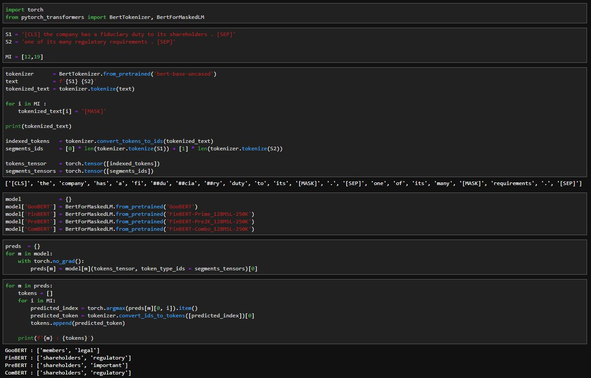

# MIDS w266 Final Project

## MOTIVATIONS

<b>Goal 1</b> `FinBERT-Prime_128MSL-500K+512MSL-10K vs BERT`
 - Compare mask LM prediction accurracy on technical financial sentences
 - Compare analogy on financial relationships

<b>Goal 2</b> `FinBERT-Prime_128MSL-500K vs FinBERT-Pre2K_128MSL-500K`
 - Compare mask LM prediction accuracy on financial news from 2019
 - Compare analogy on financial relationship, measure shift in understanding : risk vs climate in 1999 vs 2019

<b>Goal 3</b> `FinBERT-Prime_128MSL-500K vs FinBERT-Prime_128MSK-500K+512MSL-10K `
 - Compare mask LM prediction accuracy on *long* financial sentences

<b>Goal 4</b> `FinBERT-Combo_128MSL-250K vs FinBERT-Prime_128MSL-500K+512MSL-10K`
 - Compare mask LM prediction accuracy on financial sentences : can we get same accuracy with less training by building on original BERT weights.

## TERMINOLOGY
- *`Prime`* `Pre-trained from scratch on 2017, 2018, 2019 SEC 10K dataset`

- *`Pre2K`* `Pre-traind from scratch on 1998, 1999 SEC 10K dataset`

- *`Combo`* `Pre-trained continued from original BERT on 2017, 2018, 2019 SEC 10K dataset`

## ANALYSIS

